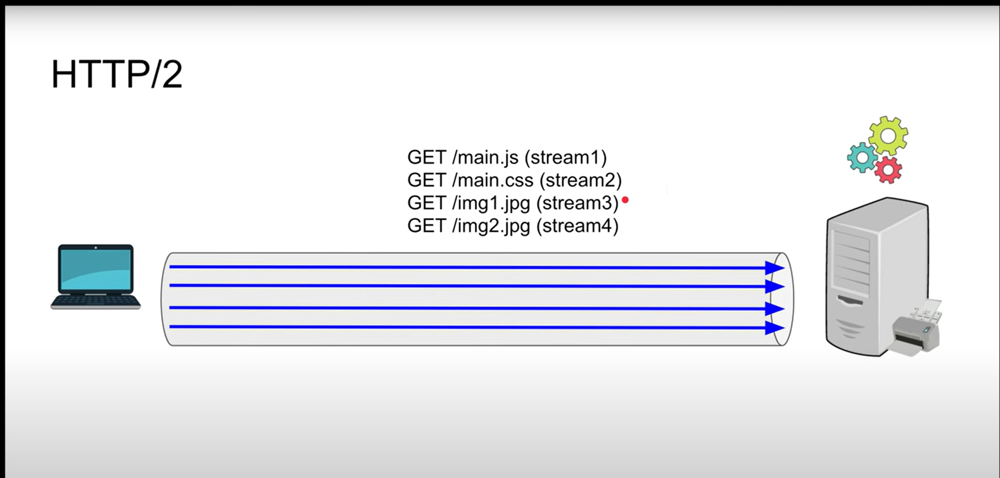

## __HTTP__
- http protocol used to fetch files. it is used `client-server artitechture`.request are initiated by browser.document is constructed from text,images,scripts etc.
- client server exchange messages (instead of stream of data).
- HTTP needs reliable protocol like `tcp or tls-encrypted `tcp connection. HTTP also used to post data to server,like `form result's`. can be used to fetch part of document to update web page.

## __Component's of HTTP-based systems:__
- request sent by `user-agent`(mostly `browser` or `proxy` on behalf) but it can be anything like `web-crawler`(robot crawls through web pages to update index's in search-engine(ex-google)).
- numerous entities b/w client-server like proxies 

### I am not continuing with the complete notes as the docs are already very consised so...

## __Proxies (Wikipedia)__
- a proxy act's as a intermediatiry b/w client & server;
- client sometime direct's request to the proxy server there it get `evaluated and network transaction`(transfer that HTTP request further to server) get performed. so it is basically helps in `load balancing`(distributing request b/w many server(no overwhelming)),`security`(no exposure of true origin ip).


## __Types:-__
- proxy can reside on same computer or in b/w. proxy that passes unmodified request and responses is a `gateway`or `tunneling proxy`.

- forward-proxy is internet facing retreive data from wide range of resource.
- reverse-proxy is internal-facing do `laod-balancing,authentication,decryption,caching`.

## __Open proxies(forward proxy):-__
- there are hundreds of thousands" of open proxies.
- `it reveals it's identity as proxy server but not origin ip address`.
- `HTTP header` - `X-Forwarded-For ` is widely used HTTP request header. `is a standard header for identifying the origin ip of client connection through proxy serve`r.(Standard version - `Forwarded`(less used))

```
X-Forwarded-For: <client>, <proxy>
X-Forwarded-For: <client>, <proxy>, …, <proxyN>
```
- content filtering can be also done by proxies through administrative provilege restrict content or authorize access.

- __Insight:-__ proxies works at application layer.

### __proxies(mdn)__
- proxies caching depends on `cache-control header: private`
means shared proxies and CDN could not cache it and if they there is possibilites of caching login credentials or other critical info. then it is prone to attacks.

  - `caching` - it stores frequently accessed data for a short period of time. if it allow's accessing unauthorized data the it is vunlerable.

  - `logging` - where it store data permanently for audit's. and if it store's user credential's then it is vulnerable.

## __Session authentication:-__
- it allows the server to rember the user when they log's in. so you don't have to renter the credential's again-n-again.

### __session authentication using cookies:-__
- `step1` - user logs in.
- `server validate credential's` by checking in database.

- if correct then it `create a session id`(random string).

- stores `session id in database or memory mapped to user-specific data`.
- `server send's set-cookie header` which has session id etc.

```pgsql
HTTP/1.1 200 OK  
Set-Cookie: sessionId=ABC123XYZ456; HttpOnly; Secure; Path=/; SameSite=Strict
```
- another time when user make request to same domain another page browser include's cookie which has session-id.

```vbnet
GET /dashboard HTTP/1.1  
Host: example.com  
Cookie: sessionId=ABC123XYZ456
```
- server authenticate user using the cookie matching session id and checking if it is expired or not.


## __HTTP/1.1__
- `browser will establish a tcp connection to the server.(it uses two way communication).you make one request from tcp (get html). then that part is busy you cant send another request as long as your request getting processed(socket is busy).but the socket is very underutilized as it capable of handling muuch.. more request.`

 - ` if i parse index.html and realize i need /man.js or main.css then you do the same thing you wait for the response.if you want to send through same TCP connection.so on.`

 - `so browser basically establish 6 TCP connection's to neglect delay. that's what browser will do today if the web server support http/1.1`

- `but the thing is http/1.1 is very inefficient and expensive(wasting resources) and that's where http/2 comes in.
`

## __HTTP/2__



- there is single a TCP  connection get established.there many request flow's through the single tcp connection.

- `but the thing is that how the server will be able to identify which request is for what or that  response is for which request ?. that's where we need stream id tag. it's numeric identifier assigned to each stream in http/2(check img 📸 above.). so the server instead of processing a single request for that socket start processing multiple request(may be multiplexing). and send the same in stream form with stream ids'`.

- `so here in http/2. we can compress the data & header's also (not in http/1.1).`


- `server push is a feature where server send's the resource's to the client before the client explicitly ask for them. ex-`
  - Client sends a normal request, e.g., for `/index.html`.

  -` Server responds with the main HTML content AND pushes additional resources, like /style.css and /script.js`, over the same HTTP/2 connection without waiting for the client to request them.

  - `The client receives all resources at once and can render the page faster.`

  -  Application layer protocol negotiation.(ALPN)
    so during tls handshake the server client negotiate for the appropriate protocol to use(HTTP/1.1,HTTP/2...).
    - client hello start tls hanshake there ALPN extension list the protocol client support's as server support's many protocol so it can choose the apropriate one from the client list.for that particular channel.

    ## __HTTP/1.0 vs HTTP/1.1__
 - in `http/1.0` every time a web page reloaded `it needed to create a new tcp connection for each resource(css,js,img),`
  it was slow opening and closing connection take time (`tcp handshake + tls handshake(if https)`).

  - `http/1.1` resolves this issue by using the exsiting tcp connection for fetching other resources.

  - http/1.0 nomrmally sends request and wait for response then send another request in sequence.

  - http/1.1 introduces pipelining so multiple request can be send before receiving the response.

  - ⚠️ Pipelining wasn't widely adapted because of issue's (head-of-line blocking).

   ## __Pipelining__
   - the biggest issue  head-of-line blocking. if the first response take's long time all the following responses are blocked until first one sent.

   - it could degrade much more performance than making single request. more it's hard to implement, cause bugs.

   -  if a single request in pipline failed it is tricky to handle or retry indidvidual request.

  ## __Chunked encoding:-__
  - in traditional http browser respond's to client usually send content-length headeer.
  - problem server must know the full size of response body in advance.
    - it is problem when content is generated dynamically generated.
    - the content is too large to buffer (video streaming)(the server cant store it in RAM to calc the complete size).
    - the server does'nt know the full content length.(unknown len of logs(ex-real time content getting wrote on the serverf),real time API's etc)
    
    __chunked transfer encoding__:-
    - allow's server to serve response in chunks.
    - The client doesn’t need to know the total size.
    - Transfer-encoding: chunked.
    - each chunk preceded by size header in bytes.

```
  4\r\n
  Wiki\r\n
  5\r\n
  pedia\r\n
```

```
  Line	Meaning
7\r\n	Next chunk is 7 bytes (hex) long → "Hello, "
Hello, \r\n	The chunk content
6\r\n	Next chunk is 6 bytes → "world!"
world!\r\n	The chunk content
0\r\n	Zero-length chunk → End of response
```

## __cache-control__ :-
- in http/1.1 caching is more sophisticated has`cache-control headers`.
ex - cache-control , ETag, last-modfied.
- it helps the browser to decide to use cached copy or ask the server for fresh version,reducing network traffic.

- `Note: more in HTTP caching`.


## __Host header__:-
- the ability to host different domain's from the same ip (server).
- host request header specifies the host and port number. of the server to which request is sent.
- if no port included the default port is (443 - https,80 - http).
- now as server can host many website's for ex - virtual hosting.
- host header field must be send in all HTTP/1.1 request messages.


## HOP(head-of-line)
- ⚠️ even `http/2 `improved lot by multiplexing as all data sent from underlying TCP layer.` AT TCP layer HOL can still occur If one TCP packet is lost during transmission, TCP’s reliability mechanism (guaranteeing in-order delivery) forces the entire connection to wait until the lost packet is retransmitted and received.`